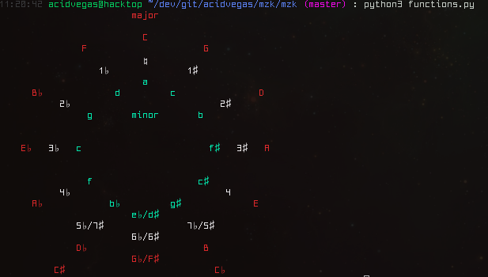
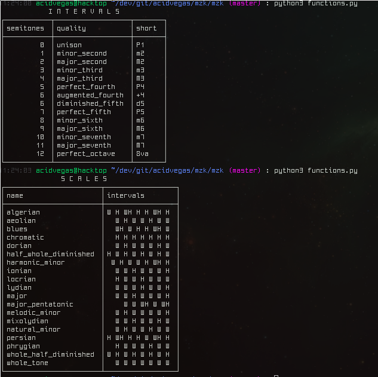
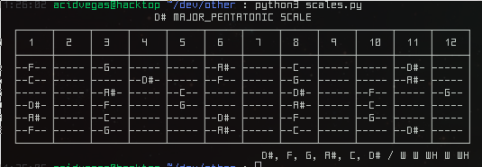

# mzk
> music theory helper

## Information
This repository originally started off as a means of using Python to learn music theory, specifcally guitar theory, since the basis of musical sound can be described mathematically *(in acoustics)* and exhibits a remarkable array of number properties.

It is still a work in progress, so some functions and features may not work as excepted or at all. Would love some collaboration on this project!

## Notes
A chromatic scale is comprised of all the semitones between an octave:
	A A# B C C# D D# E F F# G G#

Using the root of C, we can apply the pattern of the major scale to the C chromatic scale:
	C C# D D# E F F# G G# A A# B C

	C    D    E F    G    A    B C
         W    W H    W    W    W H

## Todo
* Dynamic table sizing based on item/key lengths
* Finish chord generation
* Color support for windows
* Scale/chord ASCII coloring

## Mirrors
- [acid.vegas](https://acid.vegas/mzk)
- [GitHub](https://github.com/acidvegas/mzk)
- [GitLab](https://gitlab.com/acidvegas/mzk)
- [SuperNETs](https://git.supernets.org/acidvegas/mzk)